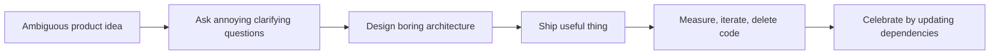

<pre>
██████╗ ██╗   ██╗ ██████╗  ██████╗ ██╗   ██╗
██╔══██╗██║   ██║██╔═══██╗██╔═══██╗╚██╗ ██╔╝
██████╔╝██║   ██║██║   ██║██║   ██║ ╚████╔╝
██╔══██╗██║   ██║██║   ██║██║   ██║  ╚██╔╝
██████╔╝╚██████╔╝╚██████╔╝╚██████╔╝   ██║
╚═════╝  ╚═════╝  ╚═════╝  ╚═════╝    ╚═╝
</pre>

# Hey, I'm Buooy — I ship internet machinery with fewer explosions than expected.

[](https://github.com/buooy)
[](https://github.com/buooy?tab=stars)
[](https://github.com/buooy)

I'm a senior engineer building at the intersection of **web3**, **gaming**, and **consumer-grade product experiences**. These days I'm working on the future of web3 gaming at **MON Protocol** — turning tokenized chaos, player loops, partner integrations, and production systems into things users can actually click without opening twelve tabs and a support ticket.

Public breadcrumbs say I've been around the stack for a while: WordPress plugins, Vue components, token-list work, web3 gaming, and enough repo history to suggest I have personally offended several linters. My LinkedIn trail also points to long-running technical leadership/fractional CTO experience around Buooy before the MON Protocol chapter, so I try to bring both hands-on engineering and grown-up product judgment to the party.

## ./whoami

```txt
role        Senior Software Engineer / Product-minded Builder
current     MON Protocol — web3 gaming, ecosystem tooling, launch infrastructure
background  Full-stack apps, WordPress, Vue, PHP, JavaScript, web3 integrations
operating   Pragmatic architecture, fast iteration, careful production habits
vibe        Senior enough to write docs. Dangerous enough to automate the docs.
```

## Tech I keep within arm's reach

<p>
  
  
  
  
  
  
  
</p>

## Things I like building

- **Web3 gaming systems** where the UX is less “summon a cryptographic goblin” and more “press button, get magic.”
- **Launch and ecosystem tooling** that helps partners move quickly without duct-taping production together at 2 a.m.
- **Full-stack products** with boringly reliable architecture, observability, and clean seams.
- **Developer workflows** that remove yak-shaving from the critical path.
- **Small sharp utilities** because sometimes the best platform feature is a script named `please-work.ts`.

## GitHub arcade cabinet

<p>
  
  
</p>

<p>
  
</p>

<p>
  
</p>

## npm-powered profile toys

This README borrows the fun parts of the dev-profile ecosystem:

- [`github-readme-stats`](https://github.com/anuraghazra/github-readme-stats) for stats cards that make commits look like trading cards.
- [`github-readme-streak-stats`](https://github.com/DenverCoder1/github-readme-streak-stats) for streaks, because apparently GitHub is also Duolingo now.
- [`github-profile-trophy`](https://github.com/ryo-ma/github-profile-trophy) for achievement unlocks without the boss music.
- [`shields`](https://github.com/badges/shields) for badges, the developer equivalent of stickers on a laptop.

## Senior engineer energy



I like teams that ship, code that explains itself, infra that fails loudly, and products that respect users' time. If it touches gaming, web3, developer experience, or turning messy ideas into clean systems, I'm probably interested.
